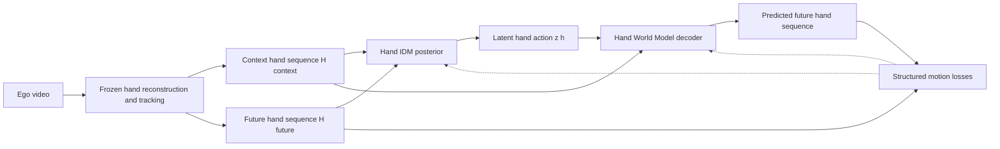

# SMPL-X Hand Latent World Model

## 1. 研究假设

本框架将 LaWAM Stage 1 的视觉 latent 模态整体替换为结构化手部状态：

```text
LaWAM:  (F_t, F_T) -> latent action -> predicted F_T
本框架: (H_t, H_T) -> latent action -> predicted H_T
```

这里的 `H` 是离线从 ego 视频恢复的 SMPL-X/MANO hand state。该模型是手部运动 world model，不是图像生成模型，也不直接预测物体损伤。

## 2. Stage 1 数据流



训练关系：

```text
q_phi(z_h | H_context, H_future)
p_theta(H_future | H_context, z_h)
```

训练后保留 `HandWorldModelDecoder` 作为 Hand-LWM；IDM 用于给下一阶段的 prior 产生 teacher latent action。

## 2.1 Stage 2：current-only latent prior

Stage 1 收敛后冻结 IDM 和 Hand-LWM：

```text
teacher: (H_context, H_future) -> frozen IDM -> z_teacher
student: H_context -> latent prior -> z_prior
rollout: (H_context, z_prior) -> frozen Hand-LWM -> predicted H_future
```

prior 是只读取当前 4 帧的 Transformer encoder，输出 64 维高斯 latent
distribution。训练同时使用 latent mean/log-variance distillation 和未来轨迹
rollout loss。推理时移除 IDM，只保留 prior + Hand-LWM，因此不再读取真实未来。

## 3. 手部状态

HOT3D pilot 每只手单独形成一条 track，并使用 24 维动态状态：

```text
wrist translation:        3
wrist rotation 6D:        6
MANO PCA pose:            15
total:                    24
```

HOT3D 的 `mano_pose.thetas` 是 15 维 PCA pose coefficients，不是 45 维关节
轴角。pilot 直接预测这些系数，不把 MANO `betas` 作为动态预测目标。获得合规
MANO assets 后，再由参数前向生成 `joints_3d [21,3]`，加入关节几何监督。

坐标系优先级：

1. 物体坐标系；
2. 去除 ego 相机运动后的世界坐标系；
3. 相机坐标系仅作为消融实验。

## 4. 模型模块

### Hand-IDM posterior

当前序列和未来序列分别线性投影为 token，加上时序位置与 current/future type embedding。Transformer encoder 的 posterior token 输出高斯分布：

```text
mu_h, logvar_h = IDM(H_context, H_future)
z_h = mu_h + exp(0.5 * logvar_h) * epsilon
```

### Hand World Model decoder

原始 baseline 由 learned future queries、单次 latent-action 加法和读取当前手部
序列 memory 的 Transformer decoder 组成。

`HMWM-LaWM-v0` 是完成 Data-D1/Test-D1 后的单变量替代 decoder。它保持
Hand-IDM、64D latent、模型宽度/层数、数据和损失不变，使用与 LaWM 对齐的
六路 AdaLN-Zero block：每层由 `z_h` 产生 attention/FFN 各自的 shift、scale
和 residual gate，调制投影零初始化。手部模态没有二维 patch grid，因此使用
12 个未来 horizon tokens 和固定 1D 时序位置编码：

```text
CV-anchor hand trajectory + fixed 1D horizon position
  -> AdaLN-Zero self-attention blocks conditioned on z_h
  -> state head
  -> residual future hand trajectory
```

这里的 CV anchor 只外推腕部平移，旋转和 MANO PCA 默认复制 context 最后一
帧，与既有 HMWM baseline 的 residual anchor 规则一致。

`HMWM-LaWM-v1` 在 v0 的12个 future-anchor tokens 前拼接完整4帧 context
tokens。context 使用固定负时间位置 `-4..-1`，future 保持 v0 的固定位置
`0..11`；二者通过同一组 AdaLN-Zero self-attention blocks 交互，最终只读取
12个 future tokens。该变更不引入新的可训练参数。

输出包括：

```text
predicted_hand_future:    [B, H, 24]
predicted_joints_future:  [B, H, 21, 3]
predicted_contact_logits: [B, H, 5]
```

## 5. 训练目标

```text
L = lambda_state * L_state
  + lambda_wrist * L_wrist_translation
  + lambda_joint * L_joint_3d
  + lambda_contact * L_contact
  + lambda_vel * L_velocity
  + lambda_acc * L_acceleration
  + beta * KL(q_phi || N(0,I))
```

代码第一版没有依赖 SMPL-X proprietary model assets，因此可以验证完整前向和反向传播。正式实验应加入 rotation geodesic loss 和可微 MANO forward-kinematics consistency，但必须在获得合规 MANO/SMPL-X 模型文件后实现。

MANO forward kinematics 的输入本身包含 wrist global orientation/translation。
如果输出关节点位于 wrist-local frame，只能把 root joint 视作局部原点，无法据此
恢复世界坐标腕部位置；如果关节点已经变换到 world frame，第 0 个 root joint
就是腕部世界位置。MPJPE 默认是评估指标，只有把关节点误差通过可微 MANO
forward kinematics 加入训练目标时，才会直接约束手部参数学习。

## 6. 与当前项目的边界

Stage 1 输出的未来人手轨迹只能作为 Linker Hand O6 候选动作的运动先验。后续仍需要：

```text
predicted human hand trajectory
  -> constrained hand retargeting
  -> UR5 + O6 candidate action chunks
  -> visual/tactile/force outcome model
  -> damage-aware candidate selection
```

第一阶段平行夹爪实验保持原 `FastWAMFragile` 路线不变；本目录是面向后续灵巧手扩展的独立研究分支。
